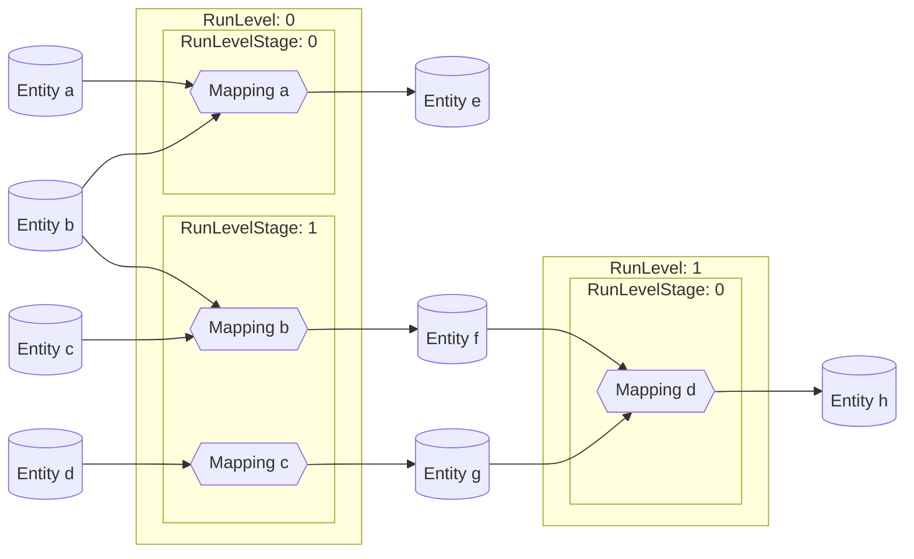
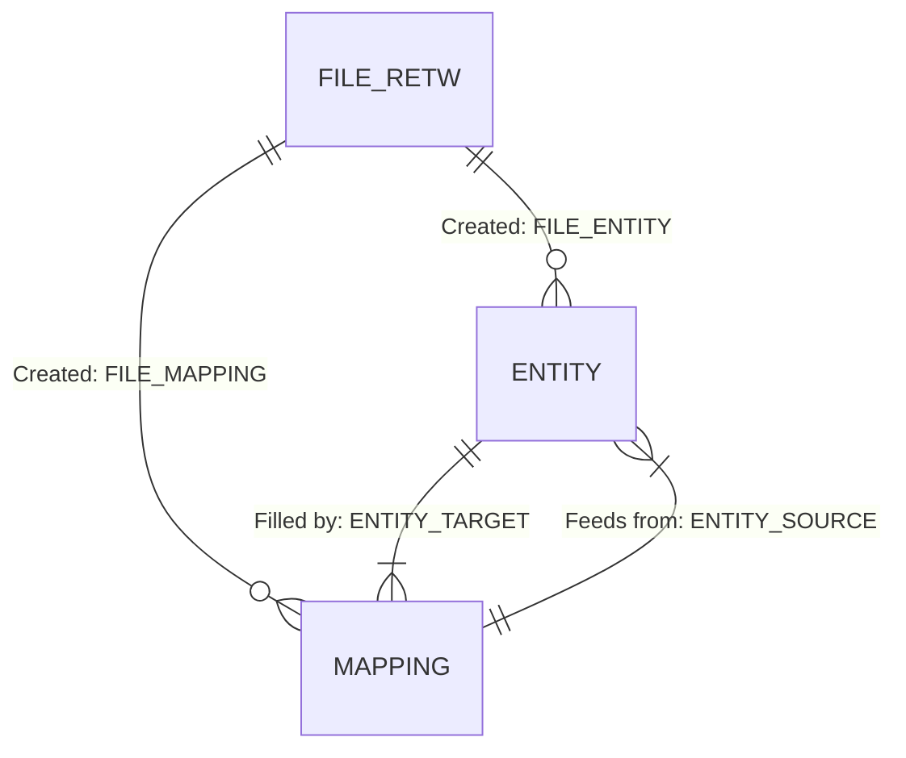
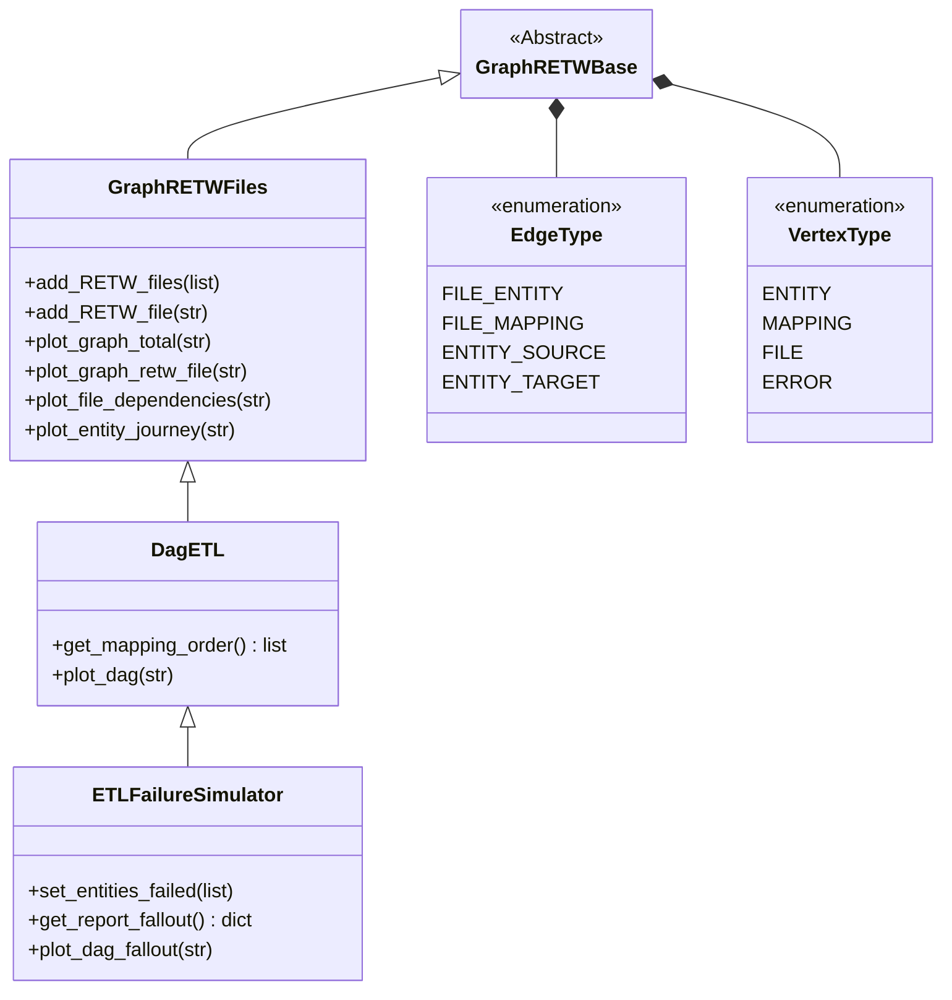

# Mapping dependency parser

Builds insights in the network of entities and mappings, by using RETW output files, to determine:

* what the [ordering of mappings](#determining-mapping-order) should be in the ETL flow, and whether the ETL flow has no closed loops (ETL-flows should be [acyclic](https://en.wikipedia.org/wiki/Directed_acyclic_graph)),
* the consequences of a failure of a step in ETL process and
* the dependencies between RETW files for entities.

## Running examples

The directory ```dependency_checker``` contains a file ```example.py``` that shows how all classes can be used for the purposes stated above.

The example references contains a list to example RETW files, that are placed in the subdirectory ```retw_examples```. The order of the files in the list is irrelevant to the functionality, so if you could add your own files to the list in a random order.

It uses the class ```GraphRETWFiles```, which is defined in the file ```graph_retw_files.py```, to create visualizations of:

* the total network of files, entities and mappings,
* a given entity's network of connected files, entities and mappings and
* dependencies between files, based on entities they have in common.

It uses the class ```EtlDag```, which is defined in the file ```dag_etl.py```, to create:

* an ordering of the mappings in an ETL flow and,
* a visualization of the ETL flow for all RETW files combined

It uses the class ```ETLFailureSimulator```, which is defined in the file ```etl_failure_simualtor.py```, to create:

* a visualization of the consequences of a ETL-flow object failing and
* a report on the failing ETL-flow objects

## Implementation documentation

### Determining mapping order

The running order of mappings is determined by two components:

* Run level: where in the Directed Acyclic Graph ([DAG](https://en.wikipedia.org/wiki/Directed_acyclic_graph)) hierarchy, going from source entities to end entities, is the mapping positioned. The mappings taking in only source entities are set at run level 0, the next run levels are determined by the number of mappings in the hierarchy running before the mapping under consideration.
* Run level stage: If mappings on the same run level share the same entities they should get different concurrency ordering to prevent deadlocking. A [greedy coloring algorithm](https://www.youtube.com/watch?v=vGjsi8NIpSE) is used to determine the run order of mappings within a run level.



### Building the ETL DAG

The mapping dependency parser uses [graphs](https://en.wikipedia.org/wiki/Graph_(discrete_mathematics)), more specifically as [DAG](https://en.wikipedia.org/wiki/Directed_acyclic_graph), which is a network representation of the files, entities (i.e. tables) and mappings. This section explains how the DAG is created.

For each RETW file, the mappings are extracted and the mappings, source- and target entities are turned into nodes (sometimes called vertices). Then there are links created (sometimes called edges) between the source entities and the mappings and the mappings and target entity. If all mappings are parsed into their nodes and edges they can be combined to form a network. This network representation allows the calculations to be performed for the objectives stated in the introduction.



In a Power Designer document (and the corresponding RETW file), all objects are identified by their 'Id' attribute which for example looks like 'o123'. This Id is internal to a document, but is not suitable for identification when we combine the RETW results of multiple Power Designer documents. For this purpose new identifiers must be created so we have no conflicting identifiers across Power Designer documents, but also maintain integrity where the target entity of one document, might serve as a source entity for a mapping in another Power Designer document. How do is this achieved?

* We assume mappings are unique across Power Designer documents. To build a mapping identifier a hash is applied to the combination of the RETW filename and the mapping object ID.
* To maintain consistency identification of entities across Power Designer documents a hash is applied to the combination of the Code and CodeModel properties of an entity.

### Classes and uses

In this section I describe the classes, what they are used for and how they fit together.


