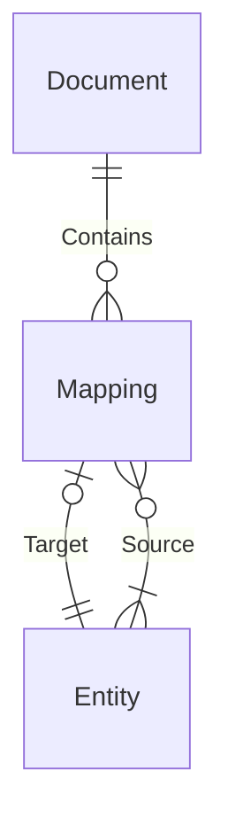

# Mapping dependency parser

Builds insights in the network of entities and mappings, by using RETW ouput files, to determine:

* what the ordering of mappings should be in the ETL flow,
* the consequences of a failure of a step in ETL process and
* whether the ETL flow has no closed loops (ETL-flows should be [acyclic](https://en.wikipedia.org/wiki/Directed_acyclic_graph)).

## Building the ETL DAG

The mapping dependency parser uses [graphs](https://en.wikipedia.org/wiki/Graph_(discrete_mathematics)), more specifically as [DAG](https://en.wikipedia.org/wiki/Directed_acyclic_graph), which is a network representation of the entities (i.e. tables) and mappings. This section explains how the DAG is created.

For each RETW file, the mappings are extracted and the mappings, source- and target entities are turned into nodes (sometimes called vertices). Then there are links created (sometimes called edges) between the source entities and the mappings and the mappings and target entity. If all mappings are parsed into their nodes and edges they can be combined to form a network. This network representation allows the calculations to be performed for the objectives stated in the introduction.

In a Power Designer document (and the corresponding RETW file), all objects are identified by their 'Id' attribute which for example looks like 'o123'. This Id is internal to a document, but is not suitable for identification when we combine the RETW results of multiple Power Designer documents. For this purpose new identifiers must be created so we have no conflicting identifiers across Power Designer documents, but also maintain integrity where the target entity of one document, might serve as a source entity for a mapping in another Power Designer document. How do is this achieved?

* We assume mappings are unique across Power Designer documents. To build a mapping identifier a hash is applied to the combination of the RETW filename and the mapping object ID.
* To maintain consistency identification of entities across Power Designer documents a hash is applied to the combination of the Code and CodeModel properties of an entity.




## Mapping order

The ordering of mappings can be determined using ```mapping_order.py``` and changing the list with filenames in the ```main``` function's variable ```lst_files_RETW```. This script also checks whether the ETL flow is acyclic.

### Determining the order

The running order of mappings is determined by two components:

* Run level: where in the DAG hierarchy, going from source entities to end entities, is the mapping positioned. The mappings taking in only source entities are set at run level 0, the next run levels are determined by the number of mappings in the hierarchy running before the mapping under consideration.
* Run level stage: If mappings on the same run level share the same entities they should get different concurrency ordering to prevent deadlocking. A [greedy colouring algorithm](https://www.youtube.com/watch?v=vGjsi8NIpSE) is used to determine the run order of mappings within a run level.

### Output

Output generated by this script can be found in the files:

* ```output/dag_structure_*.html``` shows the structure of the ETL, and
* ```output/mapping_order_*.jsonl``` that contains the ordering of the mapping executing, which can be adopted by the orchestrator.

The asterisks in the filename indicates the iteration of each RETW file added to the network. This iterative output enables troubleshooting.

## ETL job failures

A simulation a failing ETL process can be simulated using ```mapping_simulator.py```. The list with filenames in the ```main``` function's variable ```lst_files_RETW``` can be adjusted. In the same function you can 'simulate' an ETL-step failure by adjusting the list ```lst_id_entities_failed```; although the variable name suggests only entities can fail, you can also set this ID to a mapping.

### Output

Output generated by this script can be found in the files:

* ```output/dag_run_report.html``` that contains a graphical representation of the failure consequences and
* ```output/dag_run_fallout.json``` that contains a reports on the mappings/entities affected by the failure.
