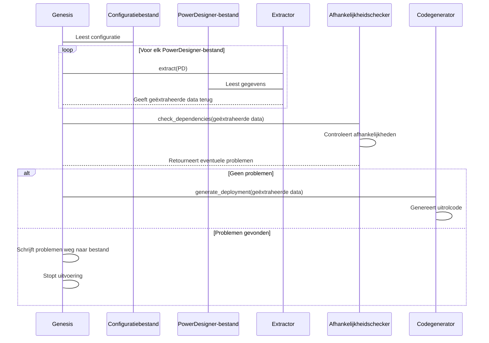
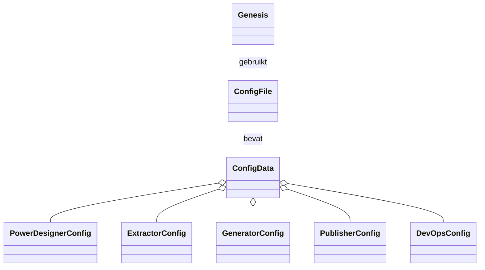
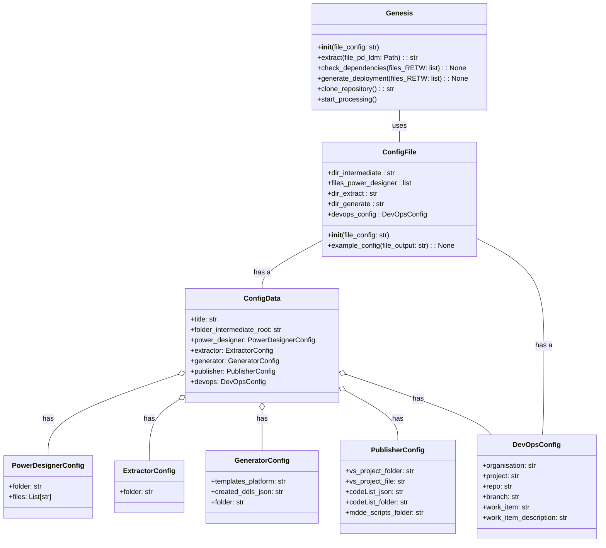

# Genesis Orkestratie

Het script ```main.py``` is het startpunt van de MMDE pijplijn genaamd Genesis. Deze pijplijn leest configuratie uit een YAML-bestand, verwerkt Power Designer-modelbestanden, controleert afhankelijkheden en genereert uitrolcode voor deployment.

## Gebruik

* Zorg dat alle PowerDesigner-bestanden op de juiste locatie staan.
* Vul een YAML-configuratiebestand in op basis van het sjabloon ([zie voorbeeld](#voorbeeld-configuratiebestand)).
* Start het script met het pad naar het configuratiebestand:

```bash
python main.py path/to/config.yaml
```

## Verwerkingsvolgorde van Genesis



## Class-diagram



## Configuratiegegevens

De configuratie wordt opgeslagen in dataclasses die zijn afgeleid van de YAML-structuur. Deze bieden typeveiligheid en automatische validatie.

### Voorbeeld configuratiebestand

```yaml
# Titel van het project of run
title: "voorbeeld-run"

# Hoofdmap waarin alle tussenbestanden en output worden opgeslagen
folder_intermediate_root: "/pad/naar/intermediate"

# Instellingen voor PowerDesigner-modellen
power-designer:
  # Submap waar PowerDesigner-bestanden zich bevinden
  folder: "PowerDesigner"
  # Lijst met LDM-bestanden die geanalyseerd moeten worden
  files:
    - "model1.ldm"
    - "model2.ldm"

# Extractor-instellingen
extractor:
  # Submap waar geëxtraheerde gegevens (RETW-bestanden) worden opgeslagen
  folder: "RETW"

# Generator-instellingen
generator:
  # Submap waar gegenereerde output wordt opgeslagen
  folder: "generator"
  # Platformconfiguratie voor templates (bijv. "dedicated-pool" of "shared")
  templates_platform: "dedicated-pool"
  # Naam van JSON-bestand waarin gemaakte DDL-bestanden worden geregistreerd
  created_ddls_json: "list_created_ddls.json"

# Publisher-instellingen
publisher:
  # Pad naar de Visual Studio-projectmap
  vs_project_folder: "VSProject"
  # Pad naar het .sqlproj-bestand binnen het project
  vs_project_file: "./CentralLayer/project.sqlproj"
  # JSON-bestand met een lijst van codelijsten
  codeList_json: "./output/codeList.json"
  # Map waarin codelijsten als input worden verwacht
  codeList_folder: "./input/codeList/"
  # Map met MDDE scripts voor deployment
  mdde_scripts_folder: "./src/mdde_scripts/"

# DevOps-integratie-instellingen
devops:
  # Naam van de Azure DevOps organisatie
  organisation: "organisatie-naam"
  # Naam van het project in Azure DevOps
  project: "project-naam"
  # Repository waarin wijzigingen worden gepusht
  repo: "repository-naam"
  # Naam van de branch waarop gewerkt wordt
  branch: "feature-branch"
  # Werkitem-ID dat gekoppeld wordt aan deze deployment
  work_item: "12345"
  # Omschrijving van het werkitem of de deployment
  work_item_description: "Beschrijving van deze automatische deployment"
```

### Belangrijke componenten

**```ConfigData```**: Bevat globale instellingen zoals de titel van het project en het pad naar de outputmap.

**```PowerDesignerConfig```**: Bevat de map en bestanden van PowerDesigner.

**```ExtractorConfig```**: Map voor geëxtraheerde RETW-bestanden.

**```GeneratorConfig```**: Bevat configuratie voor de Generator, inclusief platformtemplates, een JSON-bestand met aangemaakte DDL’s en de uitvoermap.

**```PublisherConfig```**: Bevat instellingen voor de Publisher, zoals paden naar Visual Studio-projecten, codelijsten en MDDE-scripts.

**```DevOpsConfig```**: Bevat informatie met betrekking tot DevOps-integratie, waaronder organisatie, project, repository, branch en details van het werkitem.

## API referentie

### Class-diagram met details


