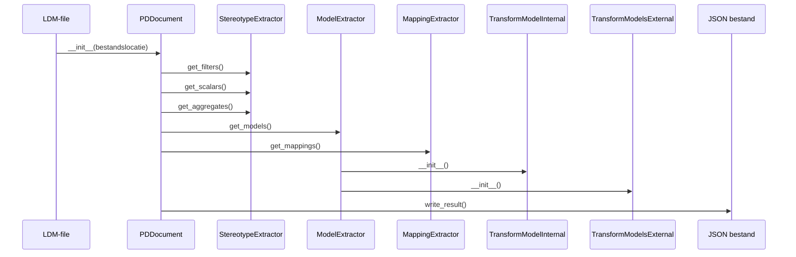

# Sequentie

```mermaid
sequenceDiagram
    LDM-file ->> PDDocument: __init__(bestandslocatie)

    PDDocument ->> StereotypeExtractor: get_filters()
    PDDocument ->> StereotypeExtractor: get_scalars()
    PDDocument ->> StereotypeExtractor: get_aggregates()
    PDDocument ->> ModelExtractor: get_models()
    PDDocument ->> MappingExtractor: get_mappings()

    ModelExtractor ->> TransformModelInternal: __init__()
    ModelExtractor ->> TransformModelsExternal: __init__()

    PDDocument ->> JSON bestand: write_result()
```