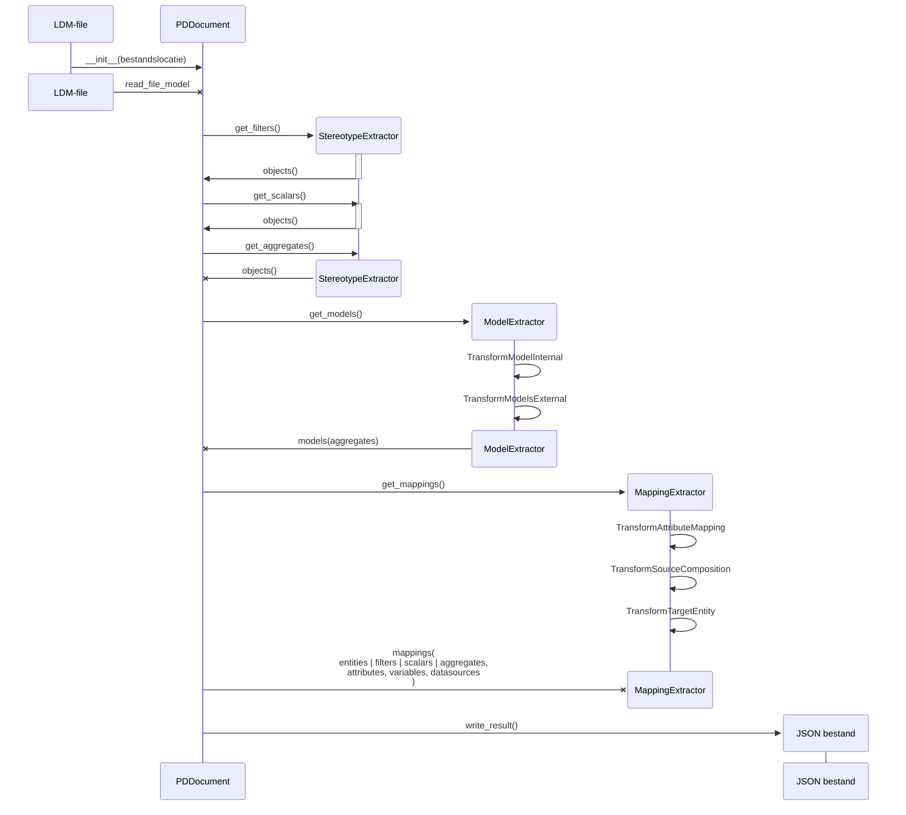

# Sequentie

```mermaid
sequenceDiagram
    LDM-file ->> PDDocument: __init__(bestandslocatie)
    destroy LDM-file
    LDM-file -x PDDocument: read_file_model

    create participant StereotypeExtractor
    PDDocument ->> StereotypeExtractor: get_filters()
    activate StereotypeExtractor
    StereotypeExtractor ->> PDDocument: objects()
    deactivate StereotypeExtractor

    PDDocument ->> StereotypeExtractor: get_scalars()
    activate StereotypeExtractor
    StereotypeExtractor ->> PDDocument: objects()
    deactivate StereotypeExtractor

    PDDocument ->> StereotypeExtractor: get_aggregates()
    activate StereotypeExtractor
    destroy StereotypeExtractor
    StereotypeExtractor -x PDDocument: objects()

    create participant ModelExtractor
    PDDocument ->> ModelExtractor: get_models()
    ModelExtractor ->> ModelExtractor: TransformModelInternal
    ModelExtractor ->> ModelExtractor: TransformModelsExternal
    destroy ModelExtractor
    ModelExtractor -x PDDocument: models(aggregates)

    create participant MappingExtractor
    PDDocument ->> MappingExtractor: get_mappings()
    MappingExtractor ->> MappingExtractor: TransformAttributeMapping
    MappingExtractor ->> MappingExtractor: TransformSourceComposition
    MappingExtractor ->> MappingExtractor: TransformTargetEntity
    destroy  MappingExtractor
    PDDocument -x MappingExtractor: mappings(<br>entities | filters | scalars | aggregates,<br> attributes, variables, datasources<br>)

    create participant JSON bestand
    PDDocument ->> JSON bestand: write_result()
```
